# 📸 Locket Upload - React Native
Ứng dụng **Locket Upload** giúp bạn tải ảnh và video lên **Locket Camera** một cách nhanh chóng và dễ dàng trên Android. Với giao diện thân thiện và tính năng thông minh, đây là công cụ lý tưởng để bạn chia sẻ khoảnh khắc với người thân và bạn bè ngay trên màn hình chính của họ.

## ✨ Tính năng nổi bật

- ✂️ **Cắt ảnh**: Đảm bảo ảnh đúng tỉ lệ 1:1 trước khi tải lên để phù hợp với giao diện Locket.
- 🎥 **Upload video**: Hỗ trợ chọn và tải video từ thư viện thiết bị.
- 📤 **Hiển thị tiến trình tải ảnh/video**: Theo dõi trực quan quá trình upload.
- 🖼️ **Xem trước ảnh/video**: Có thể xem lại trước khi xác nhận gửi.
- 🔄 **Đổi tên người dùng**: Cá nhân hóa tên hiển thị trong ứng dụng.
- 🧑‍🤝‍🧑 **Hiển thị danh sách bạn bè**: Xem và chọn người nhận trước khi upload.
- 🕰️ **Xem lại các moment cũ**: Dễ dàng xem lại những khoảnh khắc đã lưu trữ.
- 💬 **Reaction các moment của bạn bè**: Thể hiện cảm xúc với moment của người khác.
- 🚀 **Cập nhật trong app**: Nhận bản cập nhật mới ngay trong ứng dụng, không cần tải APK thủ công.

## 📦 Bản dựng sẵn có thể tải [Tại đây](https://github.com/quockhanh2004/locket_upload_react_native/releases)

[](https://github.com/quockhanh2004/locket_upload_react_native/releases)

## 📷 Hình ảnh minh họa
<details>
  <summary>Xem hình ảnh minh họa (nhấn để mở)</summary>

  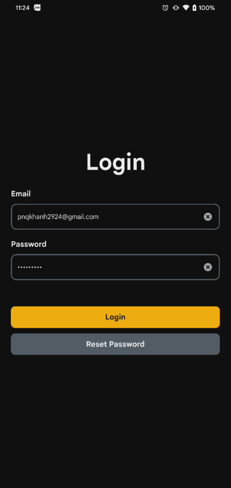  
  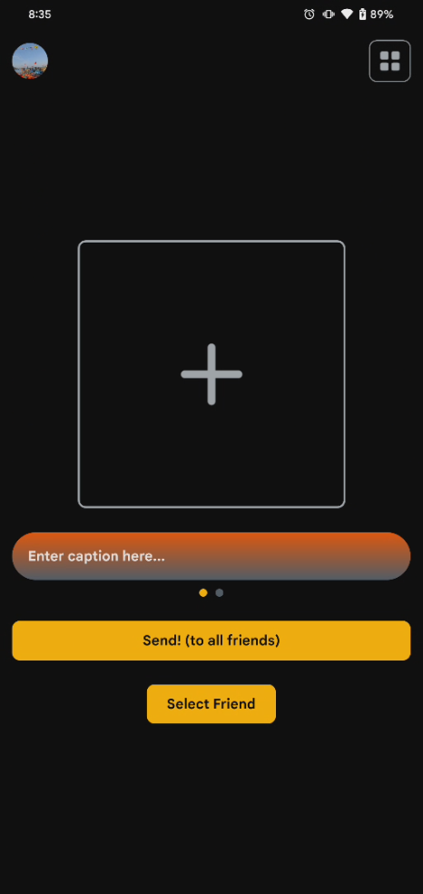  
  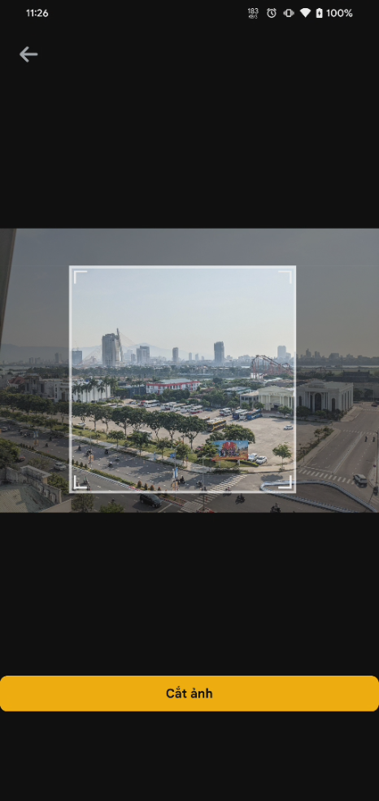  
  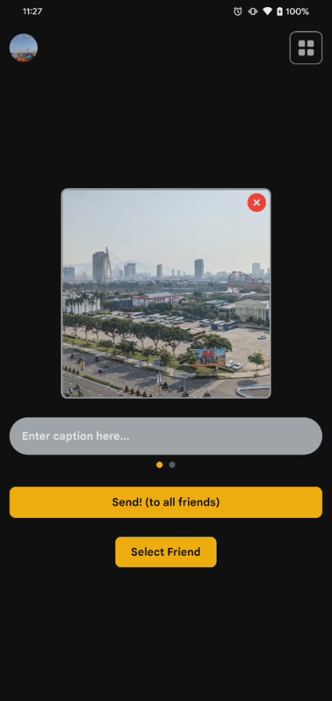  
  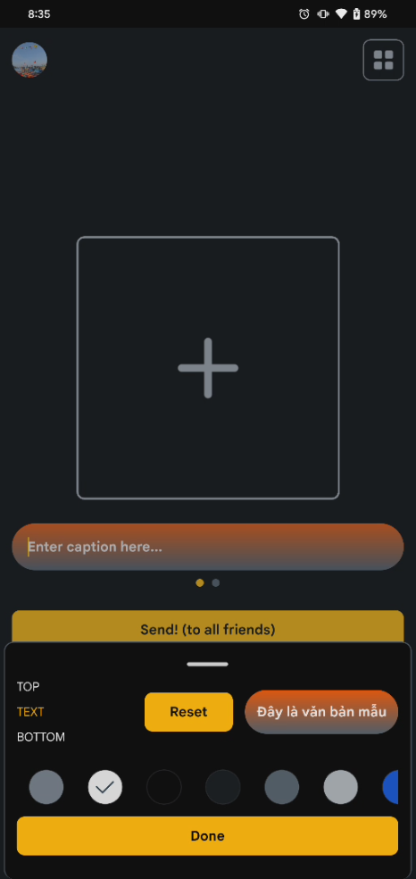  
  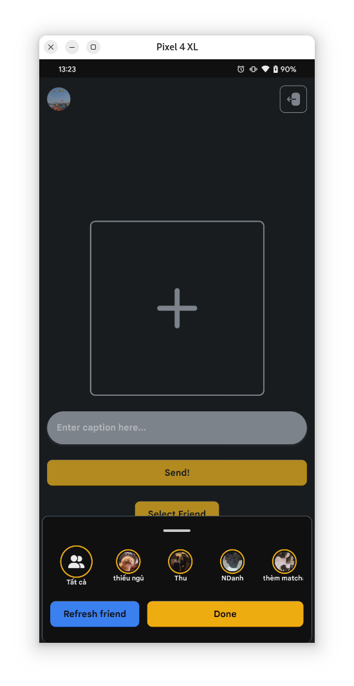  
  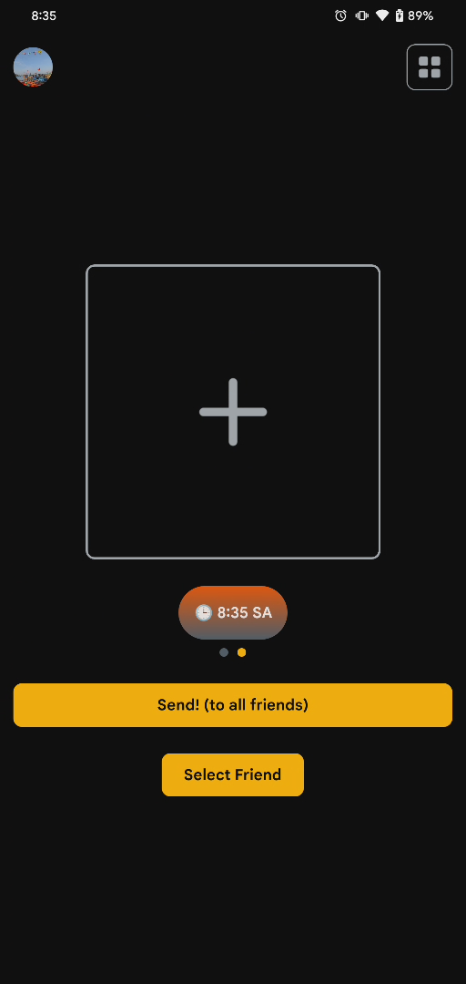  
  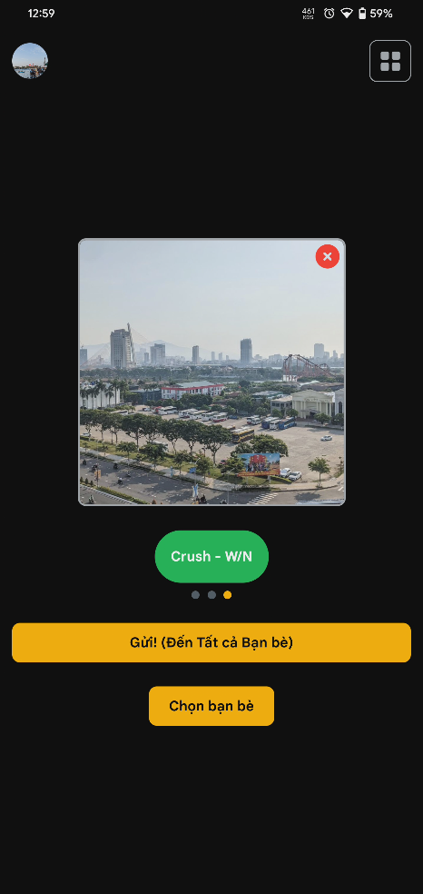  
  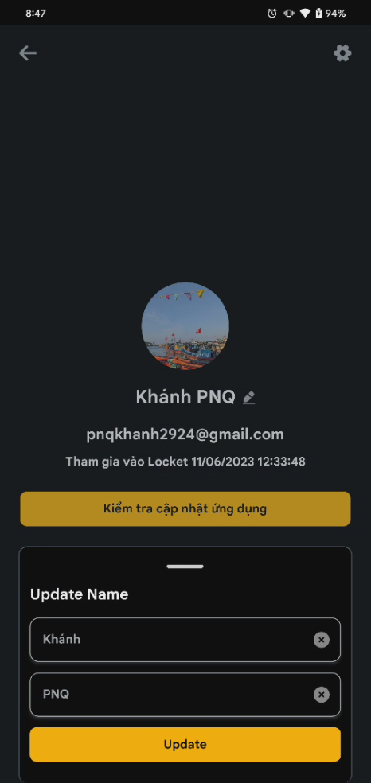  
  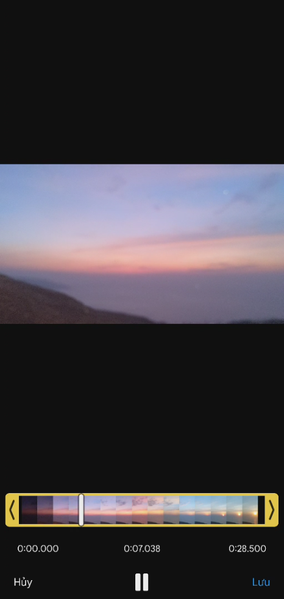  
  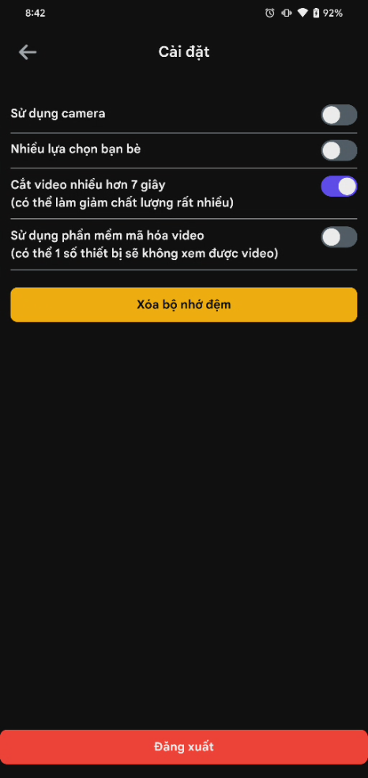  
  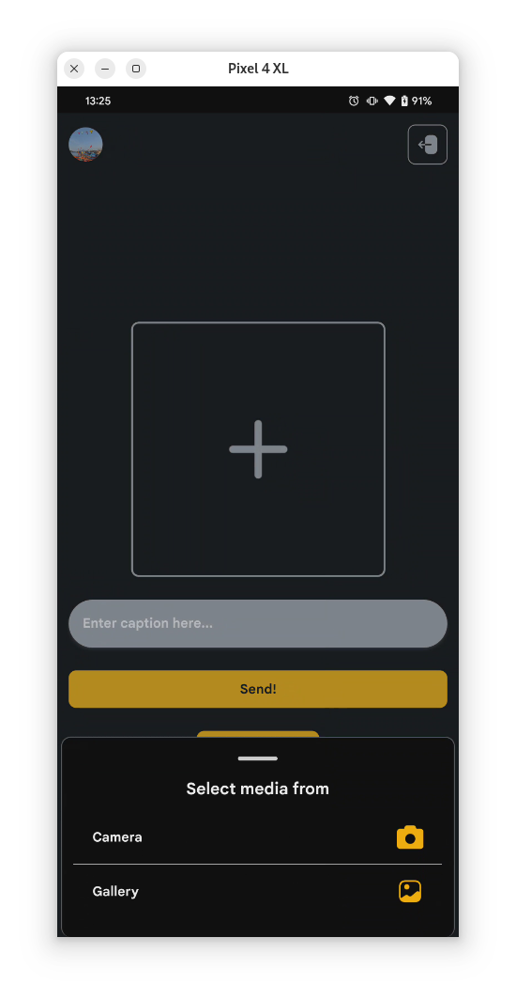  
  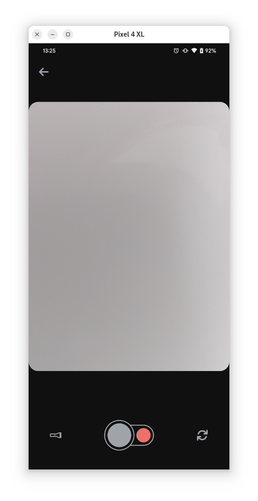  
  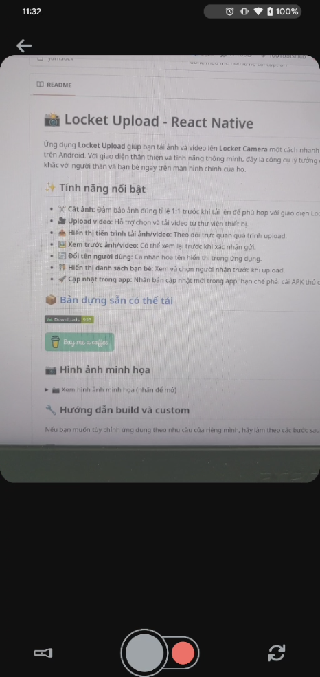  
  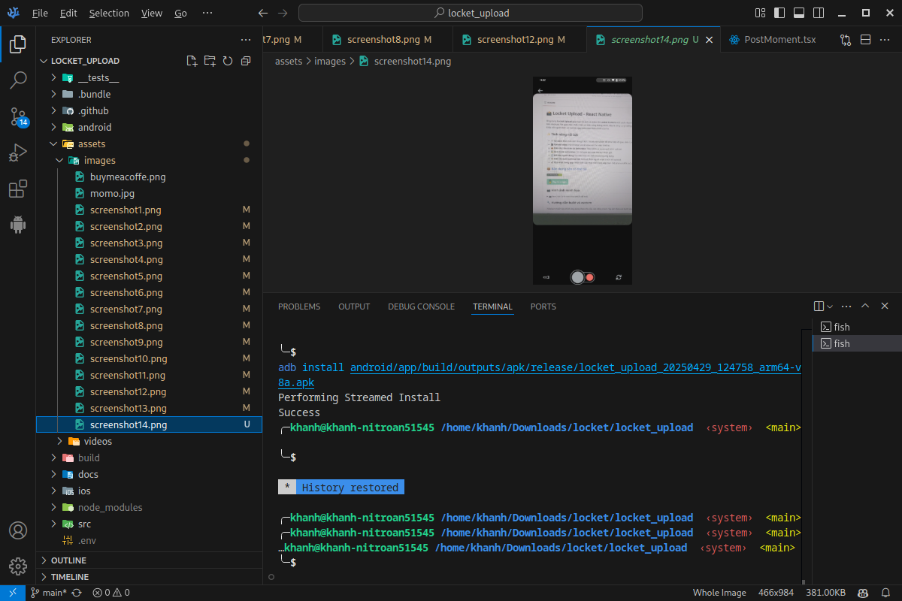  
  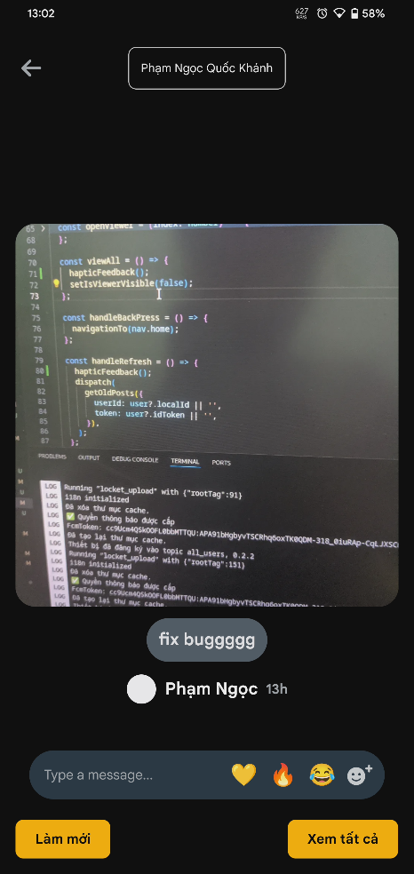  

</details>

## 🔧 Hướng dẫn build và custom

Nếu bạn muốn tùy chỉnh ứng dụng theo nhu cầu của riêng mình, hãy làm theo các bước sau:

### 1️⃣ Cài đặt môi trường

Trước tiên, hãy đảm bảo bạn đã cài đặt:

- **Node.js** (>= 16)
- **Yarn** hoặc **npm**
- **React Native CLI**
- **Android Studio** (nếu build trên Android)
- **Đổi tên file `.env.example` thành `.env`**
- **Thêm `google-services.json` từ Firebase vào thư mục `android/app/`** (để nhận thông báo khi tự build lại)

### 2️⃣ Clone repo

```sh
git clone https://github.com/quockhanh2004/locket_upload_react_native.git
cd locket_upload_react_native
```

### 3️⃣ Cài đặt dependencies

```sh
yarn install  # hoặc npm install
```

### 4️⃣ Build ứng dụng

#### Chạy trên thiết bị ảo hoặc thật

```sh
yarn start  # hoặc npm start, sau đó nhấn phím a
```

#### Build APK trên Mac OS hoặc Linux

```sh
yarn run build-android  # hoặc npm run build-android
```

#### Build APK trên Windows

```sh
yarn run build-android-windows  # hoặc npm run build-android-windows
```

APK sau khi build sẽ có trong thư mục `android/app/build/outputs/apk/release/` và sẽ tự động được cài lên thiết bị nếu kết nối qua USB.

### 5️⃣ Tuỳ chỉnh theo ý muốn

Bạn có thể thay đổi các thành phần trong source code, chẳng hạn:

- **Giao diện**: `src/components/`, `src/Dialog/`, `src/screen/`
- **API Upload**: Kiểm tra trong `src/redux/action`

## 🚀 Đóng góp

<p align="left">
  <a href="https://buymeacoffee.com/quockhanh2004" target="_blank">
    
  </a>
</p>

<p align="left">
    
</p>

Nếu bạn có ý tưởng hoặc muốn cải thiện ứng dụng, hãy tạo **Pull Request** trên GitHub!

📌 **Repo chính thức:** [GitHub - quockhanh2004/locket_upload_react_native](https://github.com/quockhanh2004/locket_upload_react_native)

---

📢 Nếu thấy hữu ích, hãy ⭐ repo nhé! 😍
