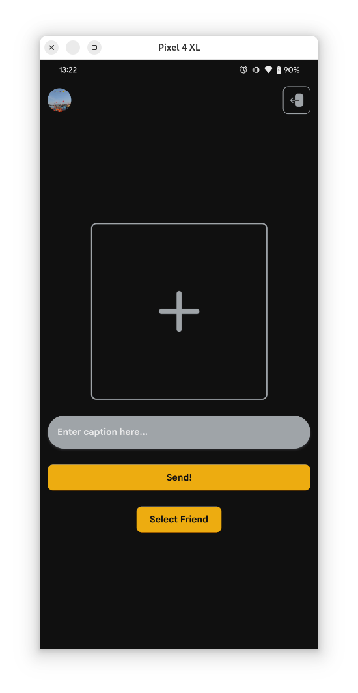
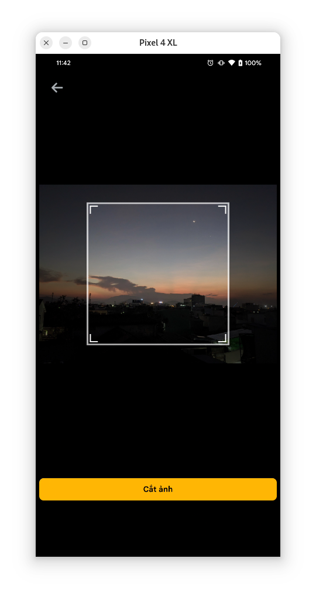
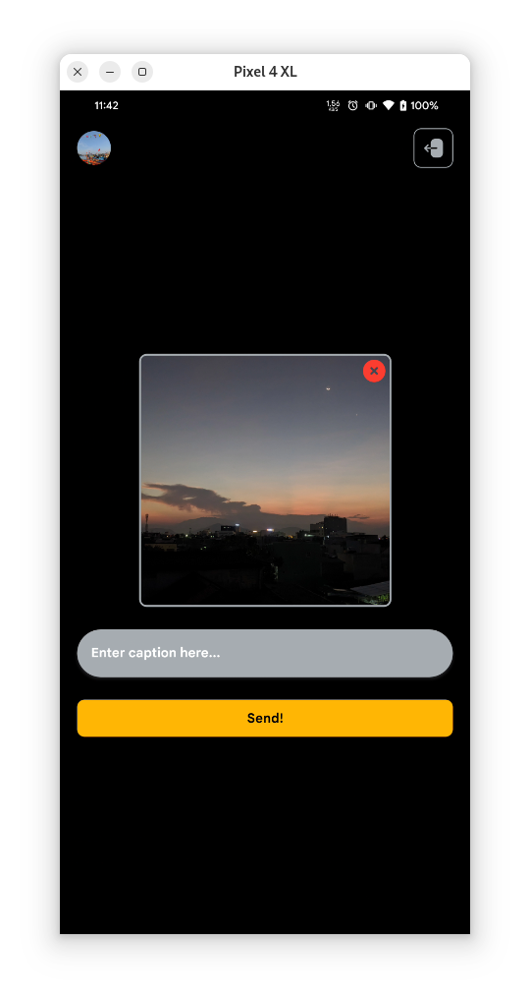

# 📸 Locket Upload - React Native

Ứng dụng **Locket Upload** giúp bạn tải ảnh lên **Locket Camera** một cách dễ dàng trên Android. 

## ✨ Tính năng nổi bật

- ✂️ **Cắt ảnh**: Đảm bảo ảnh có tỉ lệ 1:1 trước khi tải lên.
- 📤 **Hiển thị tiến trình tải ảnh**: Dễ dàng theo dõi trạng thái upload.
- 🔄 **Thay đổi tên người dùng**: Tùy chỉnh họ tên ngay trong app.
- 🚀 **Cập nhật trong ứng dụng**: Không cần cài đặt lại bằng APK.

## 📷 Hình ảnh minh họa







## Bản dựng sẵn có thể tải [Tại đây](https://github.com/quockhanh2004/locket_upload_react_native/releases)

## 🔧 Hướng dẫn build và custom

Nếu bạn muốn tùy chỉnh ứng dụng theo nhu cầu của riêng mình, hãy làm theo các bước sau:

### 1️⃣ Cài đặt môi trường

Trước tiên, hãy đảm bảo bạn đã cài đặt:
- **Node.js** (>= 16)
- **Yarn** hoặc **npm**
- **React Native CLI**
- **Android Studio** (nếu build trên Android)
- **Đổi tên file .env.exmable thành .env**

### 2️⃣ Clone repo
```sh
git clone https://github.com/quockhanh2004/locket_upload_react_native.git
cd locket_upload_react_native
```

### 3️⃣ Cài đặt dependencies
```sh
yarn install  # hoặc npm install
```

### 4️⃣ Build ứng dụng
#### Chạy trên thiết bị ảo hoặc thật
```sh
yarn start  # hoặc npm start sau đó nhấn a
```

#### Build APK trên Mac OS hoặc Linux
```sh
yarn run build-android  # hoặc npm run build-android
```

#### Build APK trên Windows
```sh
yarn run build-android-windows  # hoặc npm run build-android-windows
```
#### Sau khi build xong sẽ tự động cài đặt apk bản release lên thiết bị
APK sau khi build sẽ có trong thư mục `android/app/build/outputs/apk/release/`.

### 5️⃣ Tuỳ chỉnh theo ý muốn
Bạn có thể thay đổi các thành phần trong source code, chẳng hạn:
- **Giao diện**: Sửa trong thư mục `src/components/`, `src/Dialog/`, `src/screen/`
- **API Upload**: Kiểm tra trong `src/redux/action`

## 🚀 Đóng góp
Nếu bạn có ý tưởng hoặc muốn cải thiện ứng dụng, hãy tạo **Pull Request** trên GitHub!

📌 **Repo chính thức:** [GitHub - quockhanh2004/locket_upload_react_native](https://github.com/quockhanh2004/locket_upload_react_native)

---
📢 Nếu thấy hữu ích, hãy ⭐ repo nhé! 😍
